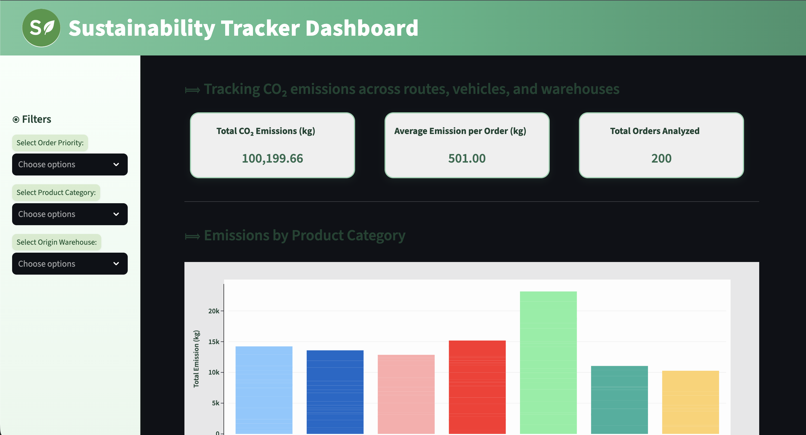
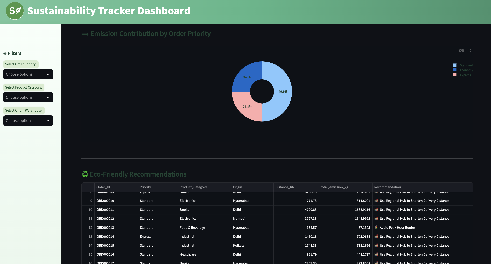

# 🌍 CO₂ Sustainability Tracker

## 📘 Overview

**CO₂ Sustainability Tracker** is a data-driven dashboard built using **Python** and **Streamlit** that visualizes and analyzes carbon emissions across routes, vehicles, and distances.
It empowers organizations and individuals to monitor emission trends, identify high-impact areas, and take actionable steps toward a more sustainable future.

---

## ✨ Features

* 🔍 **Data Insights:** Track CO₂ emissions across multiple routes and transport types.
* 📊 **Interactive Visuals:** Real-time charts powered by **Plotly** for visual analytics.
* 🌱 **Sustainability Metrics:** Evaluate environmental impact and identify optimization opportunities.
* ⚙️ **Modular Design:** Easily scalable for new datasets and custom sustainability KPIs.
* 📁 **Cached Data Loading:** Faster performance with Streamlit’s smart caching.

---

## 🧩 Tech Stack

* **Frontend:** Streamlit, Plotly 
* **Backend:** Python (Pandas, NumPy)
* **Data:** CSV files stored in `/data` directory

---

## 📂 Project Structure

```
C02_Sustainability_Tracker/
├── data/
│   ├── routes_distance.csv     # Route and distance dataset
│   ├── vehicles.csv            # Vehicle emission dataset
├── app.py                      # Main Streamlit dashboard
├── requirements.txt            # Python dependencies
├── README.md                   # Project documentation
└── assets/                     # (Optional) Charts or screenshots
```

---

## ⚡️ Installation & Setup

### 1️⃣ Clone the Repository

```bash
git clone https://github.com/priyanshpolra/C02_Sustainability_Tracker.git
cd C02_Sustainability_Tracker
```

### 2️⃣ Create Virtual Environment (optional)

```bash
python -m venv venv
source venv/bin/activate      # On Windows: venv\Scripts\activate
```

### 3️⃣ Install Dependencies

```bash
pip install -r requirements.txt
```

### 4️⃣ Run the Application

```bash
streamlit run app.py
```

Your dashboard will be available at 👉 **[http://localhost:8501](http://localhost:8501)**

---

## 🖼️ Preview

| Dashboard View                                                                                    | Emission Analysis                                                              |
| ------------------------------------------------------------------------------------------------- | ------------------------------------------------------------------------------ |
|  |  |

*(Replace with your actual screenshots once available)*

---

## 🚀 Future Enhancements

* 🌐 Integration with **real-time APIs** for live emission data.
* 🗺️ Add **map-based visualization** for route-specific emissions.
* 🧠 Incorporate **AI-based prediction models** for sustainability forecasting.
* 📈 Export analytics reports as PDF or Excel.
* ☁️ Deploy on Streamlit Cloud or Render for public access.


---

## 💡 Acknowledgements

* [Streamlit](https://streamlit.io/) for the web framework
* [Plotly](https://plotly.com/python/) for interactive graphs
* [Pandas](https://pandas.pydata.org/) for data analysis
* [NumPy](https://numpy.org/) for numerical processing

---
